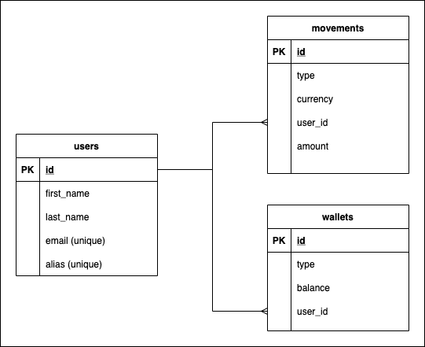

# LEMON

### ERP



### Instructions

For initializing the app and db run the following command if running it for the first time:

`docker-compose up --build`

otherwise it can be runned with 

`docker-compose up -d`

### Functionality

#### Create User

```
curl -X POST 'localhost:8080/users' -H 'Content-Type: application/json' -d '{
    "first_name": "test",
    "last_name": "test",
    "email": "test@email.com",
    "alias": "nick1"
}'
```

#### Get User by ID

```
curl -X GET 'localhost:8080/users/1'
```

Response example:

```
{
    "id": 1,
    "email": "test@email.com",
    "alias": "nick1",
    "wallets": [
        {
            "id": 2,
            "type": "ARS",
            "balance": 1120.52
        },
        {
            "id": 3,
            "type": "USDT",
            "balance": 4482.08
        },
        {
            "id": 4,
            "type": "BTC",
            "balance": 0E-8
        }
    ],
    "first_name": "test",
    "last_name": "test"
}
```

#### Create Movement

```
curl -X POST 'localhost:8080/movements' -H 'Content-Type: application/json' - '{
    "type": "DEPOSIT",
    "currency": "ARS",
    "amount": 1120.521,
    "user_alias": "nick1"
}'
```

#### Get Movements

```
curl -X GET 'localhost:8080/users/1/movements?offset=2&size=3&currency=USDT&type=DEPOSIT'
```

Response example:
```
{
    "content": [
        {
            "currency": "USDT",
            "amount": 1120.52,
            "movementType": "DEPOSIT"
        },
        {
            "currency": "USDT",
            "amount": 1120.52,
            "movementType": "DEPOSIT"
        },
        {
            "currency": "USDT",
            "amount": 1120.52,
            "movementType": "DEPOSIT"
        },
        {
            "currency": "USDT",
            "amount": 1120.52,
            "movementType": "DEPOSIT"
        }
    ],
    "pageable": {
        "sort": {
            "sorted": false,
            "unsorted": true,
            "empty": true
        },
        "offset": 6,
        "pageNumber": 2,
        "pageSize": 3,
        "paged": true,
        "unpaged": false
    },
    "totalPages": 4,
    "totalElements": 11,
    "last": false,
    "size": 3,
    "number": 2,
    "sort": {
        "sorted": false,
        "unsorted": true,
        "empty": true
    },
    "numberOfElements": 5,
    "first": false,
    "empty": false
}```

### MISC

#### Known issues

- Missing unit tests
- Missing some integration tests
- Currently there's limited exception handling
- Long build times
